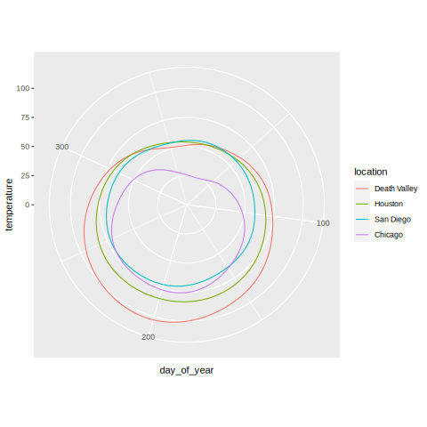

# Coordinate Systems

## Cartesian Coordinates

- The most common coordinate system is the Cartesian system.

- Units do not affect the coordinate system just the scale.
- If (x,y) measure the same thing, the aspect ratio must be 1:1 otherwise the
  plot is very misleading. If (x,y) measure different things, then your are
  free to change the aspect ratio of the plot as you wish.

### Log Scale

A log scale is appropriate when the fundamental operation you have is
multiplicative. This scale can be misleading because people are bad at
inverting the log function. It should be easy for the reader to understand what
is going on. The fix for this problem is to use the original data values using
log spacing.

# Nonlinear Coordinate Systems

## Polar Coordinates

With polar coordinates, the plot becomes circular. This is useful when the data
you are analyzing is circular in nature. An example would be data mapped to
calendar days. In polar coordinates, x-values are on the circular axis and
y-values are on the radial axis. For the radial axis, start at y=0 and sweep
counter-clockwise. # Further Reading

```{r}
ggplot(temperatures, aes(day_of_year, temperature, color = location)) +
  geom_line() +
  coord_polar() +
  scale_y_continuous(limits = c(0,105)) # fix up temperature limits
```



- Fundamentals of Data Visualization: Chapter 3 Coordinate systems and axes
- 'ggplot2' reference documentation: Scales
- 'ggplot2' reference documentation: Coordinate systems
- 'ggplot2' book: position scales
- 'ggplot2' book: coordinate systems

tags: #dataviz
