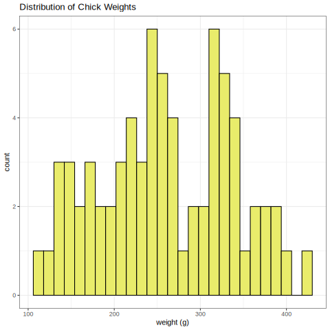
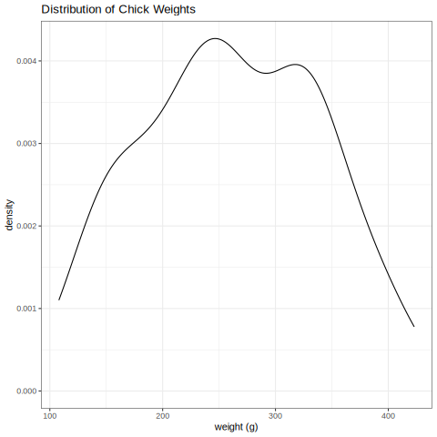

# Visualizing Distributions

## Histogram

The most common way to visualize the spread of a dataset is the
histogram. A histogram sorts the data into bins and counts the number of
cases in each bin.

``` {R}
library(ggplot2)

ggplot(chickwts, aes(weight)) +
  geom_histogram(color="black",fill="#E9EC6B", binwidth=12, center=112) +
  labs(title = "Distribution of Chick Weights") +
  xlab("weight (g)") +
  theme_bw()
```



The width and center of the bins is set manually in `ggplot2`.
If the width is too small, data that does not get exist is captured and
the result is a spiky looking histogram. If the width is too big, you
hide important features in the datasets. Show raw counts on the y-axis
because that is the most intuitive.

## Kernel Density Plot

A kernel density plot shares the same purpose as a histogram. It shows
the spread of the data. The difference is that it produces a smooth line
and the y-axis is scaled in proportion to the x-axis. The area under the
curve is equal to one.

``` {R}
library(ggplot2)

ggplot(chickwts, aes(weight)) +
  geom_density() +
  labs(title = "Distribution of Chick Weights") +
  xlab("weight (g)") +
  theme_bw()
```



## Issues

-   KDE\'s can show non-sensical data such as age falling below zero.
-   Displaying more than one distribution with a histogram or KDE can
    lead to confusion.
    -   An alternative is to create a pyramid if you have two
        distributions. Flip the counts on the y-axis and point them in
        opposite directions.
    -   KDE\'s can be shown with two plots side by side (facets in
        `ggplot2`).

# References

-   UT Austin DSC-385
