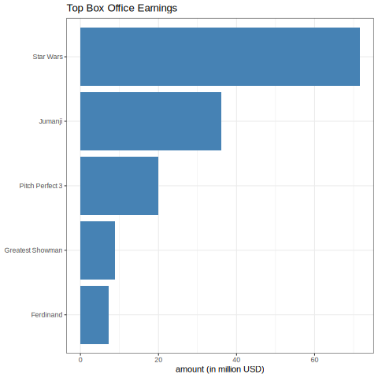
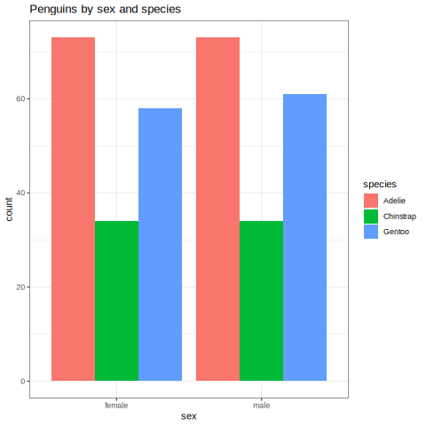

# Visualizing Amounts

## Bar Plots

The most common way to visualize this type of data is to use a bar or
column chart.

``` {R}
library(tidyverse)

boxoffice <- tibble(
  rank = 1.5,
  title = c("Star Wars", "Jumanji", "Pitch Perfect 3", "Greatest Showman", "Ferdinand"),
  amount = c(71.57, 36.16, 19.93, 8.81, 7.32) # million usd
  )

ggplot(boxoffice, aes(amount, fct_reorder(title, amount))) +
  geom_col(fill="steelblue") +
  xlab("amount (in million USD)") +
  ylab(NULL) +
  labs(title="Top Box Office Earnings") +
  theme_bw()
```



The length of the bar represents the given amount. The bars can be
flipped horizontally if you have a lot of categories. It makes the plot
more compact and easier to read. All the text is horizontal which also
makes the figure easier to read.

If no inherent order is given (time), then sort the bars by frequency.
This makes the plot easier to read and reason about the information.

## Dot Plots

Dot plots can be used instead of bars. These are preferable if we want
to truncate the axes. For example, if we were plotting life expectancies
for multiple countries, it makes sense to truncate the axes. People do
not live to be 200 and do not die at age 5 on average.

Do not use bar plots if you truncate the axes. The length of the bars no
longer represents the amount given. This is very misleading to the
audience. With lots of categories, bars can obscure the differences
between categories.

## Grouped Bar Plots

Grouped bar plots are used for higher dimensional datasets.

``` {R}
library(ggplot2)
library(palmerpenguins)

penguins_nomissing <- na.omit(penguins) # remove all rows with any missing values
ggplot(penguins_nomissing, aes(sex, fill=species)) +
  geom_bar(position = "dodge") +
  labs(title="Penguins by sex and species") +
  theme_bw()
```



Order the groupings in a way that makes sense overall for the dataset.
Be aware, some choices that may seem innocent at the time can have a big
impact in how the figures are perceived by the audience. You could
wittingly or unwittingly mislead your audience into believing the wrong
idea. (i.e. color, color scale, arrangement, etc.).

We can also use multiple plot panels (facets).

Make plot with facets.

# Further Reading

-   Fundamentals of Data Visualization: Chapter 6: Visualizing Amounts
-   Data Visualization - A Practical Introduction: Chapter 4.4: Geoms
    can transform data
-   `ggplot2`{.verbatim} reference documentation:
    `geom_bar()`{.verbatim}, `geom_col()`{.verbatim}
-   `ggplot2`{.verbatim} reference documentation:
    `position_stack()`{.verbatim}, `position_fill()`{.verbatim}

# References

-   UT Austin DSC385
