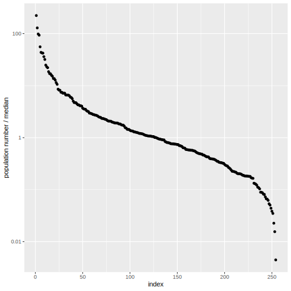

# Coordinate Systems

## Cartesian Coordinates

-   The most common coordinate system is the Cartesian system.

-   Units do not affect the coordinate system just the scale.

-   If (x,y) measure the same thing, the aspect ratio must be 1:1
    otherwise the plot is very misleading. If (x,y) measure different
    things, then your are free to change the aspect ratio of the plot as
    you wish.

### Log Scale

A log scale is appropriate when the fundamental operation you have is
multiplicative. This scale can be misleading because people are bad at
inverting the log function. It should be easy for the reader to
understand what is going on. The fix for this problem is to use the
original data values using log spacing.

``` {R}
library(tidyverse)

tx_counties <- read_csv("https://wilkelab.org/DSC385/datasets/US_census.csv") %>%
  filter(state == "Texas") %>%
  mutate(popratio = pop2010/median(pop2010)) %>%
  arrange(desc(popratio)) %>%
  mutate(index = 1:n())

ggplot(tx_counties, aes(index, popratio)) +
      geom_point() +
      scale_y_log10(
          name = "population number / median",
          breaks = c(0.01, 1, 100),
          labels = c("0.01", "1", "100")
      )
```



# Nonlinear Coordinate Systems

## Polar Coordinates

With polar coordinates, the plot becomes circular. This is useful when
the data you are analyzing is circular in nature. An example would be
data mapped to calendar days. In polar coordinates, x-values are on the
circular axis and y-values are on the radial axis. For the radial axis,
start at y=0 and sweep counter-clockwise.

``` {R}
library(tidyverse)

temperatures <- read_csv("https://wilkelab.org/DSC385/datasets/tempnormals.csv") %>%
  mutate(
    location = factor(
      location, levels = c("Death Valley", "Houston", "San Diego", "Chicago")
    )
  ) %>%
  select(location, station_id, day_of_year, month, temperature)

ggplot(temperatures, aes(day_of_year, temperature, color = location)) +
  geom_line() +
  coord_polar() +
  scale_y_continuous(limits = c(0,105)) # fix up temperature limits
```


# Further Reading

-   Fundamentals of Data Visualization: Chapter 3 Coordinate systems and
    axes
-   `ggplot2`{.verbatim} reference documentation: Scales
-   `ggplot2`{.verbatim} reference documentation: Coordinate systems
-   `ggplot2`{.verbatim} book: position scales
-   `ggplot2`{.verbatim} book: coordinate systems

# References

-   UT Austin DSC385
